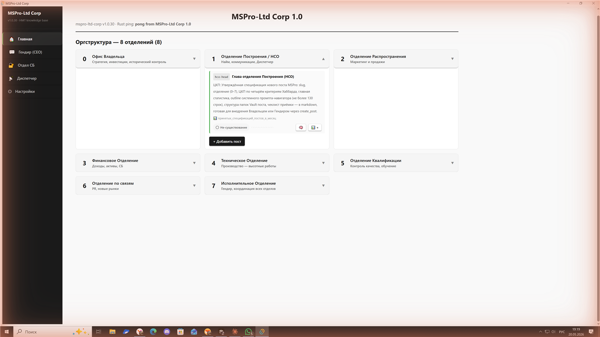
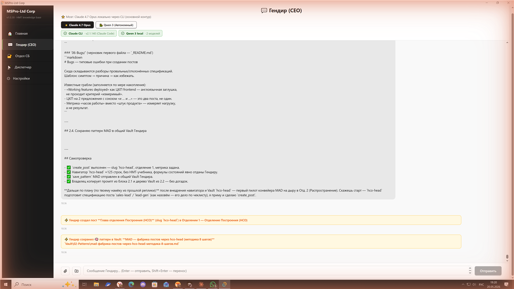
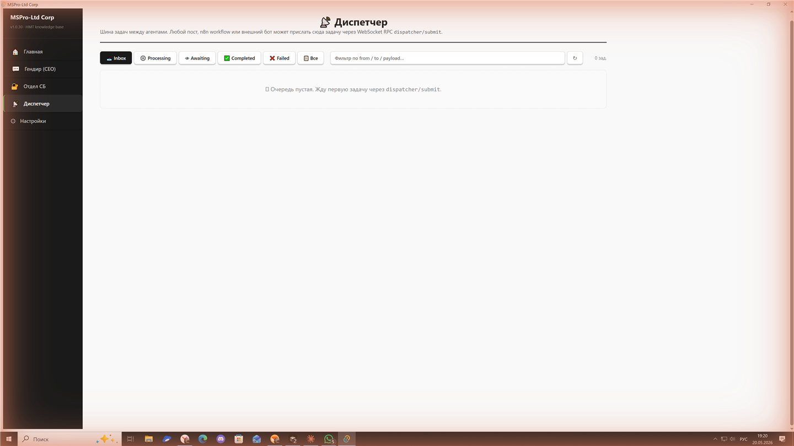
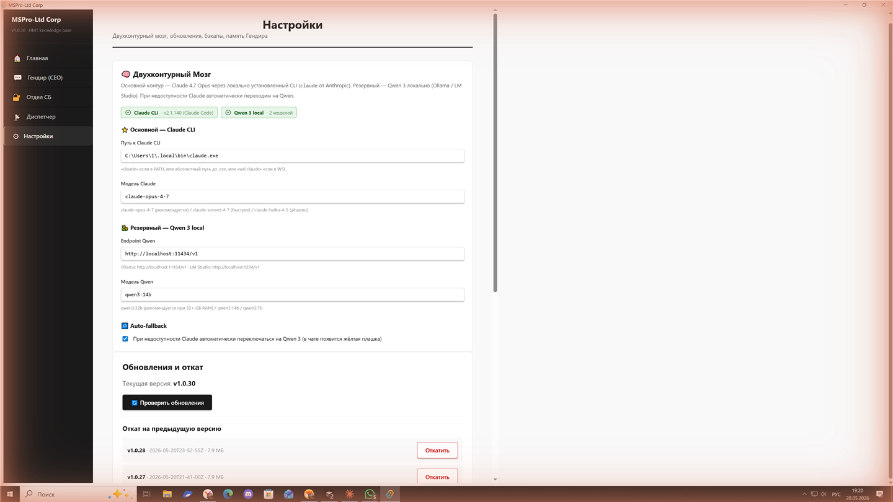

# MSPro-Ltd Corp

**Десктоп-система управления компанией через AI-агентов, построенная по технологии управления Л. Рона Хаббарда.**


## Что это

MSPro-Ltd Corp — внутренний инструмент управления для компании ООО «МСПро» (специализированные высотные работы: промышленный альпинизм, антикоррозийная защита, монтаж). Это нативное Windows-приложение, которое моделирует компанию как организацию из 8 отделений по канону Хаббарда и даёт «постам» (должностям) собственный AI-мозг.

В отличие от чат-ботов общего назначения, приложение знает оргструктуру конкретной компании, ведёт статистики каждого поста, автоматически определяет «Состояние» поста (по формулам Хаббарда) и помогает Гендиру (CEO-агенту) принимать управленческие решения. Гендир не только советует, но и исполняет действия — создаёт посты, ставит задачи Диспетчеру, сохраняет опыт компании в долговременную память.

Работает полностью локально: данные хранятся в SQLite на машине владельца. AI — двухконтурный: облачный Claude как основной мозг и локальный Qwen 3 как резервный. Если облако недоступно, компания продолжает работать.

## Возможности

- **8 отделений Хаббарда** — оргструктура с постами, ЦКП (ценными конечными продуктами) и метриками
- **Гендир (CEO-агент)** — двухконтурный мозг: Claude CLI с автоматическим fallback на локальный Qwen 3 (two-circuit brain)
- **HMT-движок** — статистики постов, автоопределение Состояний (Опасность / Норма / Изобилие / Власть …) по формулам Хаббарда, тренды и спарклайны
- **База знаний HMT** — встроенный справочник по управлению (формулы состояний, оргсхема, ЦКП, финпланирование), доступный Гендиру через инструмент `read_hmt_topic`
- **Интеллектуальный Диспетчер** — Hub-and-Spoke брокер задач: переписывает сырые запросы в развёрнутые промпты и маршрутизирует исполнителям (Phase 11C)
- **Посты-агенты** — пост может запустить собственный Claude в изолированном sandbox и произвести артефакт: `.docx` / `.xlsx` / `.pdf` (Phase 11B)
- **Память компании (Vault)** — файловое хранилище паттернов и побед, подмешивается в контекст Гендира
- **Security Vault** — секреты под Windows DPAPI (Credential Manager), без хранения в открытом виде
- **WebSocket-шлюз** — JSON-RPC 2.0 на `127.0.0.1:8899` с токен-авторизацией для внешних интеграций
- **COM-сервер** — `MSProLtdCorp.Application` для вызова из Python / VBA / PowerShell (Phase 11D)
- **Авто-обновление** — через GitHub Releases с подписанными MSI и откатом к предыдущей версии

## Скриншоты

| Главная — отделения и посты | Чат с Гендиром (CEO) |
|---|---|
|  |  |

| Интеллектуальный Диспетчер | Настройки мозга |
|---|---|
|  |  |

## Технологический стек

| Слой | Технология |
|---|---|
| UI | React 19 + TypeScript 5.8 |
| Сборка фронтенда | Vite 7 |
| Бэкенд | Rust + Tauri v2 |
| База данных | SQLite (sqlx 0.8 + tauri-plugin-sql) |
| AI (основной) | Claude через локальный CLI |
| AI (резервный) | Qwen 3 локально (OpenAI-совместимый HTTP) |
| Секреты | Windows DPAPI (`keyring`) |
| Сеть | WebSocket (`tokio-tungstenite`) + `reqwest` |
| Интеграции | COM-сервер (`windows-implement`), Job Objects (`win32job`) |
| Обновления | `tauri-plugin-updater` (подпись minisign) |
| Платформа | Windows 10 / 11 (`.msi`) |

## Установка

### Для пользователей
1. Скачать последний `.msi` из [Releases](https://github.com/vladimirspecalp-hub/MSPro-Ltd-Corp-1.0/releases/latest)
2. Запустить установщик
3. Приложение само проверяет обновления и обновляется по кнопке в интерфейсе

### Для разработчиков
```bash
pnpm install
pnpm tauri dev    # разработка (фронтенд + бэкенд, hot-reload)
pnpm tauri build  # production-сборка .msi
```

Требования: **Node.js 20+**, **Rust 1.77+**, **pnpm**.
Перед коммитом: `pnpm tsc --noEmit` (0 ошибок) и `cd src-tauri && cargo test --lib`.

## Архитектура

```
┌──────────────────────────────────────────────┐
│  React 19 + TypeScript  (WebView2)            │
│  Главная · Чат CEO · Диспетчер · Vault · ⚙    │
└───────────────┬──────────────────────────────┘
                │  Tauri invoke (40+ команд)
┌───────────────┴──────────────────────────────┐
│  Rust-ядро (Tauri v2)                         │
│  ├─ commands/         CEO chat, posts, диспетчер│
│  ├─ context_assembler динамическая сборка промпта│
│  ├─ vault             файловая память + HMT-знания│
│  ├─ external_agent    WS-шлюз :8899 (JSON-RPC) │
│  ├─ com_server        MSProLtdCorp.Application  │
│  └─ secrets           DPAPI                     │
└───────┬────────────────────────┬───────────────┘
        │                        │
   ┌────┴─────┐          ┌───────┴────────┐
   │ SQLite   │          │ AI-мозги       │
   │ app.db   │          │ Claude / Qwen 3│
   └──────────┘          └────────────────┘
```

Данные живут в SQLite (`%APPDATA%\ru.msproltd.corp\app.db`), память компании — в файловом Vault рядом с БД. На каждый запрос Гендир собирает контекст (оргструктура + статистики + знания + история диалога с динамическим бюджетом окна модели) и обращается к мозгу. Ответ может содержать `tool_call`-блоки, которые ядро исполняет атомарно через SQLite.

Полная карта Rust-модулей — в [`.claude/instructions/03-backend.md`](.claude/instructions/03-backend.md), схема БД — в [`.claude/instructions/04-database.md`](.claude/instructions/04-database.md).

## Roadmap

- **Phase 11D (в работе)** — COM-сервер для интеграции с Python / VBA / PowerShell (IDispatch)
- Суммаризация длинных диалогов и полнотекстовый поиск по истории чата
- Новые инструменты Гендира: запись статистик и листинг задач Диспетчера прямо из чата
- MCP-мост для CEO (sequential-thinking и другие серверы)

## Лицензия

Proprietary © ООО «МСПро». Все права защищены. Внутренний продукт компании, не предназначен для распространения.

## Контакты

**Владимир Андреевич Бровяков** — ООО «МСПро» (Металлиум Систем Протект)
Репозиторий: https://github.com/vladimirspecalp-hub/MSPro-Ltd-Corp-1.0
